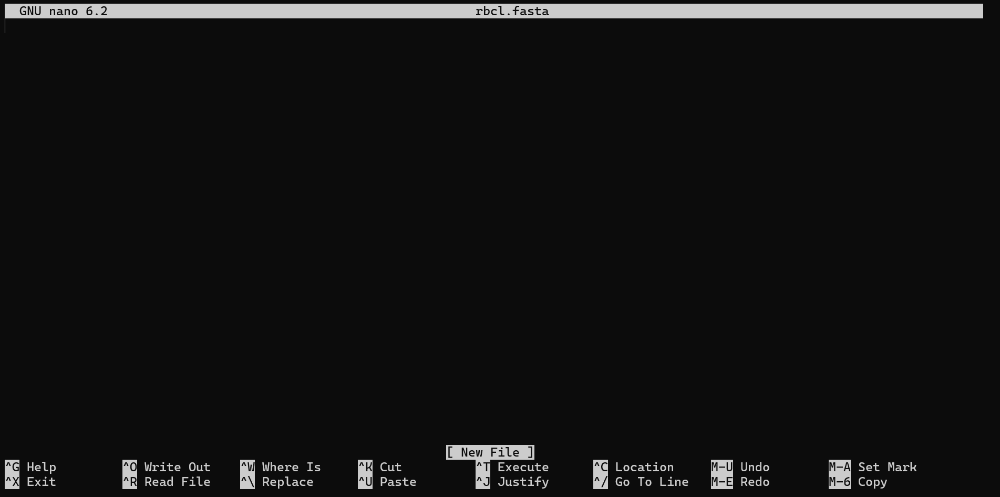
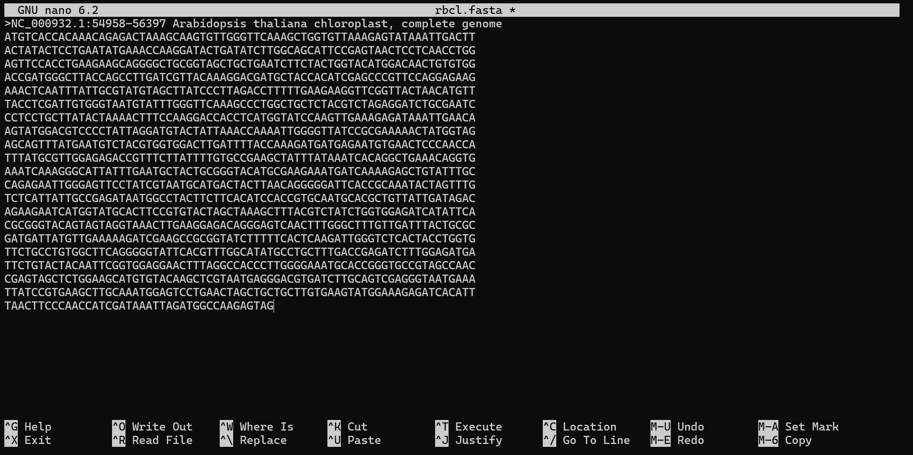
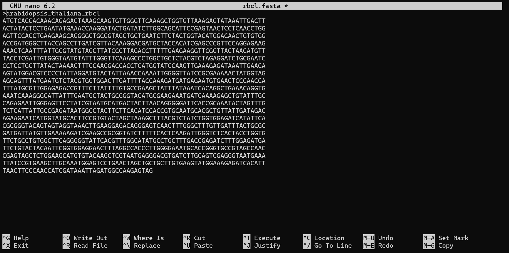

### What is Linux?
Linux is an open-source operating system that has become a powerful tool for researchers, especially in fields like bioinformatics, data analysis, and scientific computing. Unlike commercial operating systems, Linux offers:

- **Free and Open-Source**: No cost, with the ability to modify and share the software
- **High Performance**: Excellent for handling large datasets and complex analyses
- **Flexibility**: Supports a wide range of scientific and research tools
- **Powerful Command-Line Interface**: Enables efficient task automation and data management


### Basic introduction to Linux

With a Linux terminal, sometimes called a _command prompt_, _console_, or _command-line interface_ you interact with your computer using only text entered via the keyboard, which is executed by hitting the return key. 

There are hundreds of different commands, but don't worry, you only need a handful of commands to get started. Generally, commands follow the format below:


We will work through some of the most commonly used commands to help get you started. 

#### Printing text

One of the simplest commands is `echo` which is used to print text on the terminal. Type the command below in the terminal and hit enter:

```
echo Hello World!
```

In this example, the command is `echo` and the argument is `Hello World!`. The output should look like this: 


 
As you can see, it has printed the text "Hello World!" to the terminal. 

#### Print working directory

To find where we are, we can use the command `pwd` which is an abbreviation for **p**rint **w**orking **d**irectory. 

```
pwd
```

Note that commands in Linux and software programs **are case sensitive**. This means that `Pwd` is not the same as `pwd`. 

This command prints our location in the Linux system. When we log in, we always start in our home directory which should read as `/home/<username>/`, where username is specific to you. 

#### Make a directory

Let's try a new command, `mkdir` to **m**a**k**e a new **dir**ectory. A directory is just another name for a folder. We will call our new directory "new_directory". 

```
mkdir new_directory
```

Note, when naming files or directories, it is best to avoid spaces. Instead, use underscores "_"or hypens "-" to separate words. Also avoid special characters such as ' ? , ( ) ! & * + ; etc. 

#### List a directory

To see if our directory has been created, we need to use another command `ls` to **l**i**s**t a directory.

```
ls
```

Your output should show that your new directory has been created. 


This command shows us all the files and directories in our present working directory. Note that your home directory will look different to mine, but it should contain a directory called 'new_directory'. 

Let's now look an example of using the `ls` command with the option `-l` which lists files in long format. Enter the command below: 

```
ls -l
```

The output should look like this, with one file or directory per line and additional details on each. A description of the output has been added below.    


the **link count** is the number of references pointing to that file or directory in the filesystem.

#### Changing directory

Once we have set up our new directory, we can use the command `cd` to **c**hange **d**irectory. 

```
cd new_directory
```

If you have changed directory successfully, you will notice that your prompt has changed to include your new directory location.

We can also use `pwd` again to check our present working directory. 


{: .note }
> **Handy keyboard shortcuts**
> - **Tab** — autocomplete a file or directory name
> - **↑ / ↓ arrow keys** — scroll through your command history
> - **Ctrl + C** — cancel a running command

##### Working with directories

If you think of your directory and other items within it (files sometimes other directories) as a tree, then you can imagine moving between them by moving up or down. Here are some other useful tips to working with directories and moving between files effectively.

As we have already seen, to change to a directory one below you are in, just use the `cd` command followed by the subdirectory name:

```
cd subdir_name
```

To change directory to the one above your are in, use the shorthand for "the directory above" `..`

```
cd ..
```

You can change to any directory by explicitly stating the full path too

```
cd /usr/local/bin
```

If you wish to return to your home directory at any time, just type `cd` by itself.

```
cd
```
or
```
cd ~
```

And finally, you can return to the last directory you were working in before this one by typing:
```
cd -
```

If you get lost and want to confirm where you are in the directory structure, remember the `pwd` command. 

#### Redirecting outputs

We can use Linux to redirect the output of a command to a new file. For example, let's redirect the output of echo to a new file. To redirect an output, we use a special character `>`, for example: 

```
echo Hello World! > new_file.txt
```

This command will create a new file called `new_file.txt`. Remember to avoid using spaces and special characters when creating files or directories. The file suffix `.txt` just lets us know that this is a text file. 

We can check if our new file has been created using ls. 

```
ls
```

Now that we have created a new file and can see it is in our working directory, we can print the file to the terminal using `cat`, which stands for con**cat**enate. This command prints the file to the terminal, and it takes the file name as an argument. 
```
cat new_file.txt
```

Here we can see that the file "new_file.txt", contains the text "Hello World!".

Note that using redirection with ">" overwrites a file. For example, try running the following will change the contents of "new_file.txt"and print the output to the terminal.  

```
echo Hello again! > new_file.txt
cat new_file.txt
```

However, if we use redirection with ">>", it appends new lines to a file. Try the follow for example. 
```
echo Hello World! > new_file.txt
echo Hello Again! >> new_file.txt
echo This is another line! >> new_file.txt
cat new_file.txt
``` 

#### Moving (renaming) files

Now that we have a file, we can rename the file using `mv`, which is an abbreviation for **m**o**v**e. This command takes two arguments, the original file name and the new file name.

```
mv new_file.txt another_file.txt
ls
```

Here, we renamed the file `new_file.txt` to `another_file.txt`. 

To move a file to a different directory instead of renaming it, provide the destination directory as the second argument:

```bash
mv another_file.txt new_directory/
```

This moves `another_file.txt` into `new_directory` without changing its name. You can also move and rename in one step:

```bash
mv another_file.txt new_directory/renamed_file.txt
```

#### Copying files

If we want to create a copy of a file, we can use the cp which stands for copy. Like the move command, it takes an input file and output file.
```
cp another_file.txt another_copy.txt
ls
```
 
#### Removing files 

Let's say we are happy with our Linux practice so far and we are ready to start clearing up directory. We can use the `rm` command to **r**e**m**ove unwanted files. 
```
rm another_file.txt
rm another_copy.txt
ls
```

#### Removing directories

Now we might want to remove the directory called `new_directory`. To do this, first we want to change directory back to our home directory. 

```
cd /home/<your_username>/
pwd
```
 
We can then try to remove our directory with the following command:
```
rm new_directory
```
However, we should get an error message which say's we cannot remove `new_directory` because it is a directory. 

But this is no problem. To remove directories, we need to specify a special option. To see all options available for a command we can look at the help information using options `-h` or `--help`. Try the commands below, both will have the same output: 
```
rm --help
rm -h
```

Using `-h` or `--help` will print information on the usage and options available for a command. Both `-h` or `--help` do the same thing, option specified with `--` tend to be more verbose and readable than options specified with `-` which tend to be more shorthand. Here we can see an option to "remove directories and their contents recursively"which can be specified by -r, -R or --recursive. Let's try to remove the directory again. 

```
rm -r new_directory
```

Now the directory has been removed. **Note, once you remove a file or directory in Linux, you cannot get it back!** There is no recycle bin in Linux! So be very careful with removing important files.  

#### Creating text files with nano
It is possible to create and edit files using text editors in Linux. For the training, we will use `nano` although there are lots of different options available.

Let's create a new text file called "rbcl.fasta" using nano.

```
nano rbcl.fasta
```

The nano command takes the name of the file that you want to create or edit as an input argument. When you run the command, the nano text editor will open and will look like this: 



Let's paste in some sequence information. Below is a fasta file for the rbcL gene in *Arabidopsis thaliana*. Copy this and paste it into the nano text editor. Note, to paste text into a terminal, right click the terminal where you want to paste the text. You can also paste text using the keys "Ctrl + V" in Windows or "Command + V" in Mac.
```
>NC_000932.1:54958-56397 Arabidopsis thaliana chloroplast, complete genome
ATGTCACCACAAACAGAGACTAAAGCAAGTGTTGGGTTCAAAGCTGGTGTTAAAGAGTATAAATTGACTT
ACTATACTCCTGAATATGAAACCAAGGATACTGATATCTTGGCAGCATTCCGAGTAACTCCTCAACCTGG
AGTTCCACCTGAAGAAGCAGGGGCTGCGGTAGCTGCTGAATCTTCTACTGGTACATGGACAACTGTGTGG
ACCGATGGGCTTACCAGCCTTGATCGTTACAAAGGACGATGCTACCACATCGAGCCCGTTCCAGGAGAAG
AAACTCAATTTATTGCGTATGTAGCTTATCCCTTAGACCTTTTTGAAGAAGGTTCGGTTACTAACATGTT
TACCTCGATTGTGGGTAATGTATTTGGGTTCAAAGCCCTGGCTGCTCTACGTCTAGAGGATCTGCGAATC
CCTCCTGCTTATACTAAAACTTTCCAAGGACCACCTCATGGTATCCAAGTTGAAAGAGATAAATTGAACA
AGTATGGACGTCCCCTATTAGGATGTACTATTAAACCAAAATTGGGGTTATCCGCGAAAAACTATGGTAG
AGCAGTTTATGAATGTCTACGTGGTGGACTTGATTTTACCAAAGATGATGAGAATGTGAACTCCCAACCA
TTTATGCGTTGGAGAGACCGTTTCTTATTTTGTGCCGAAGCTATTTATAAATCACAGGCTGAAACAGGTG
AAATCAAAGGGCATTATTTGAATGCTACTGCGGGTACATGCGAAGAAATGATCAAAAGAGCTGTATTTGC
CAGAGAATTGGGAGTTCCTATCGTAATGCATGACTACTTAACAGGGGGATTCACCGCAAATACTAGTTTG
TCTCATTATTGCCGAGATAATGGCCTACTTCTTCACATCCACCGTGCAATGCACGCTGTTATTGATAGAC
AGAAGAATCATGGTATGCACTTCCGTGTACTAGCTAAAGCTTTACGTCTATCTGGTGGAGATCATATTCA
CGCGGGTACAGTAGTAGGTAAACTTGAAGGAGACAGGGAGTCAACTTTGGGCTTTGTTGATTTACTGCGC
GATGATTATGTTGAAAAAGATCGAAGCCGCGGTATCTTTTTCACTCAAGATTGGGTCTCACTACCTGGTG
TTCTGCCTGTGGCTTCAGGGGGTATTCACGTTTGGCATATGCCTGCTTTGACCGAGATCTTTGGAGATGA
TTCTGTACTACAATTCGGTGGAGGAACTTTAGGCCACCCTTGGGGAAATGCACCGGGTGCCGTAGCCAAC
CGAGTAGCTCTGGAAGCATGTGTACAAGCTCGTAATGAGGGACGTGATCTTGCAGTCGAGGGTAATGAAA
TTATCCGTGAAGCTTGCAAATGGAGTCCTGAACTAGCTGCTGCTTGTGAAGTATGGAAAGAGATCACATT
TAACTTCCCAACCATCGATAAATTAGATGGCCAAGAGTAG
```
Once you have pasted the text, it will look like this: 



Once we are finished editing, we can save our text file by pressing the keys "Ctrl + o". 

Nano will ask you if you would like to write the file to "rbcl.fasta". Hit the Enter key to save to this file. 

To exit nano, press the keys "Ctrl + x". To check you changes, you can cat the file again: 
```
cat rbcl.fasta
```

Let's imagine we wanted to edit the sequence name to something simpler, such as ">arabidopsis_thaliana_rbcl". To do this, open our file using nano again. 
```
nano rbcl.fasta
```
To edit the fasta file, use the cursor keys to move to the first line (your mouse will not work here), and remove the first line by pressing the Delete key and replace with ">arabidopsis_thaliana_rbcl". It should now look like this:



As before, save your changes by pressing "Ctrl + o" and hit Enter to confirm the file name. Then exit nano by pressing "Ctrl + x".

You can check your edit by printing the file to the terminal again:
```
cat rbcl.fasta
```

The sequence header should now read `>arabidopsis_thaliana_rbcl`, while the sequence itself is unchanged.

Congratulations - you have now learned the core commands for working in Linux: printing text, navigating directories, creating and editing files, and cleaning up after yourself. The sections below introduce a few more commands that you will find useful as you become more confident.

#### Getting help for a command

Almost every command comes with built-in documentation. As we saw with `rm`, you can use the `-h` or `--help` option to print a short summary of how to use a command:
```
ls --help
```

For more detailed documentation, use the `man` command (short for **man**ual), which opens the full manual page for a command:
```
man ls
```
Use the arrow keys to scroll, and press `q` to quit the manual page.

#### Viewing the contents of a file

We have already used `cat` to print an entire file to the terminal. For larger files this can be unwieldy, so the following commands are often more convenient:

- `less rbcl.fasta` - view a file one screen at a time (use the arrow keys to scroll and `q` to quit).
- `head rbcl.fasta` - print just the first 10 lines of a file.
- `tail rbcl.fasta` - print just the last 10 lines of a file.

You can change the number of lines shown by `head` or `tail` with the `-n` option, for example `head -n 5 rbcl.fasta`.

#### Using wildcards

When working with lots of files, wildcards let you match several files at once. The most common wildcard is the asterisk `*`, which matches any number of characters. For example, to list all files ending in `.fasta`:
```
ls *.fasta
```
Or to list every file beginning with `rbcl`:
```
ls rbcl*
```

#### Searching inside files

The `grep` command lets you search for a word or pattern inside a file. For example, to search for the word "Arabidopsis" in our fasta file:

```bash
grep "Arabidopsis" rbcl.fasta
```

This will print any lines containing that word. `grep` is case sensitive by default, use the `-i` option to make it case insensitive:

```bash
grep -i "arabidopsis" rbcl.fasta
```

To search across multiple files at once, you can use a wildcard:

```bash
grep "Arabidopsis" *.fasta
```

#### File permissions

When you run `ls -l`, the first column shows the **permissions** of each file or directory, for example `-rw-r--r--`. These describe who is allowed to **r**ead, **w**rite, and e**x**ecute the file. You can change permissions with the `chmod` command. For example, to make a script executable:
```
chmod +x myscript.sh
```
You will use this later when running your own scripts on an HPC system.

{: .note }
> There are many guides to Linux available online. A good starting point is this [Introduction to Unix](https://bioinformaticsworkbook.org/Appendix/Unix/unix-basics-1.html) from the Bioinformatics Workbook.

